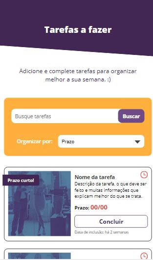
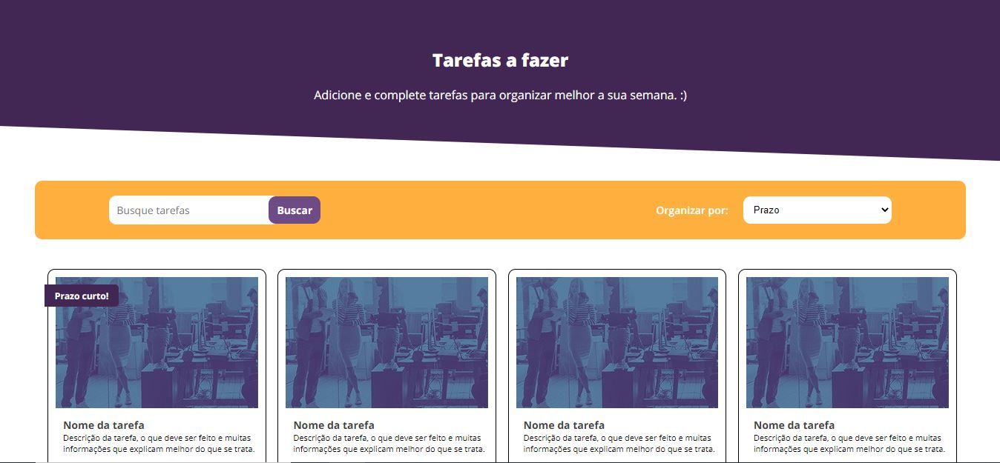

<p align='center'></p>  
<h1 align='center'>WebDesigner Junior - Linx 🐱‍🏍</h1>  
<p align='center'>O layout foi desenvolvido seguindo todas as instruções do FIGMA. Nenhuma adversidade a ressaltar com base no prototipo apresentado. Utilizei o padrão BEM para padronização de classes e "7-1 Folder" para arquitetura do SCSS. HTML estruturado para integração de API e exibição dos dados nos Card Components. </p>  
<p align='center'>
 <p align='left'> </p>
 </p>  


 - Clonar o projeto
```
git clone https://github.com/Nicochess/linx-webdesigner-test.git
```
<h2>Resultado do Desafio 🐱‍💻</h2>
<p> ✔ <a href='https://nicochess.github.io/linx-webdesigner/'>Confira o resultado</a></p>
